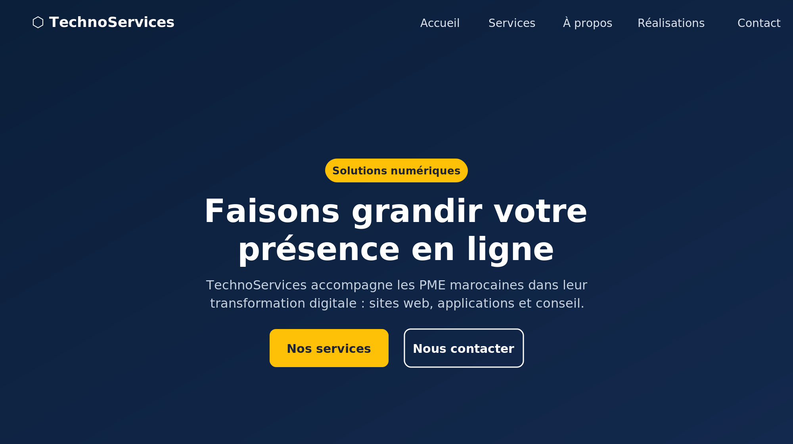
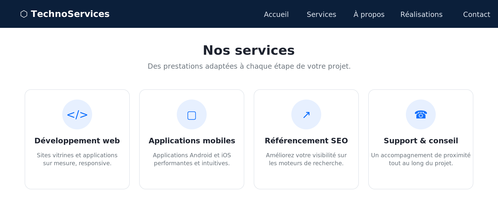
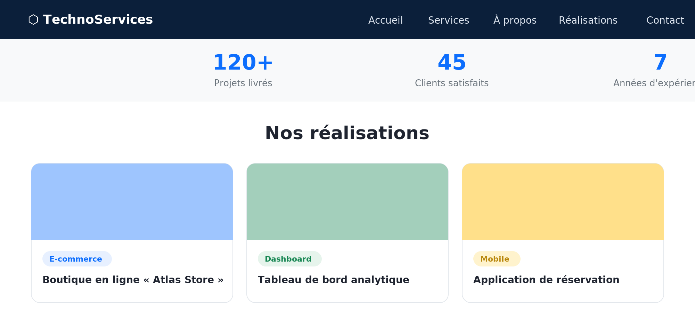
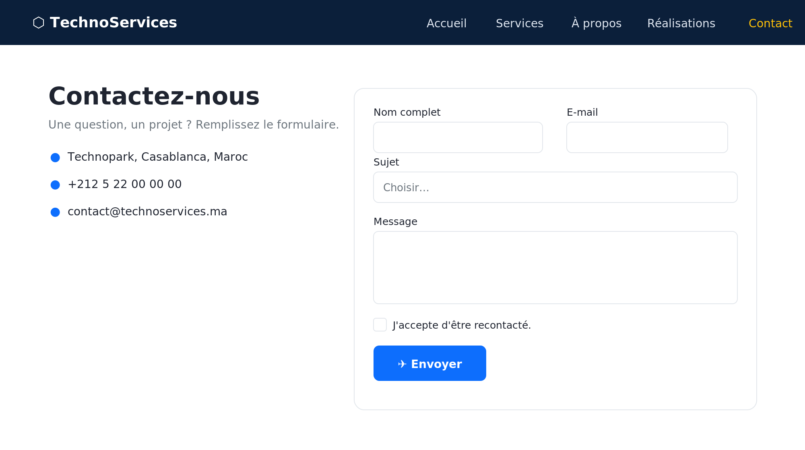

# TechnoServices — Site vitrine responsive (HTML5 · CSS3 · Bootstrap 5)

Site vitrine d'entreprise **entièrement responsive**, réalisé lors de mon **premier stage / première initiation au développement web**. Le projet met en pratique les fondamentaux du front : structure HTML5 sémantique, mise en page avec la **grille Bootstrap 5**, composants (navbar, cards, formulaire), feuille de style CSS3 personnalisée et un peu de **JavaScript vanilla** (navbar au défilement, bouton « haut de page », compteurs animés, validation de formulaire).

Projet de **Badr Chigar** — Ingénieur d'État en Informatique (EMSI Casablanca).

## Captures d'écran

| Accueil (hero) | Services |
|:---:|:---:|
|  |  |

| Réalisations & chiffres clés | Page contact (formulaire validé) |
|:---:|:---:|
|  |  |

## Fonctionnalités

- **Mise en page responsive** (mobile-first) avec la grille et les utilitaires Bootstrap 5.
- **Navbar fixe** qui devient opaque au défilement et se replie en menu burger sur mobile.
- **Sections** : hero plein écran, services (cards au survol), à propos avec compteurs animés, réalisations, bande d'appel à l'action, pied de page.
- **Page contact** avec **formulaire validé côté client** (validation native Bootstrap : champs requis, e-mail, case de consentement) et message de confirmation.
- **JavaScript vanilla** : effet navbar, bouton retour en haut, fermeture du menu mobile, compteurs animés via `IntersectionObserver`.

## Stack technique

| Élément | Détail |
|---|---|
| Structure | HTML5 sémantique |
| Style | CSS3 (`css/style.css`) + Bootstrap 5.3 (CDN) |
| Icônes | Bootstrap Icons |
| Scripts | JavaScript vanilla (`js/main.js`) |
| Dépendances | Aucune installation — Bootstrap chargé via CDN |

## Structure du projet

```
premier-stage-bootstrap/
├── index.html          page d'accueil (hero, services, à propos, réalisations)
├── pages/
│   └── contact.html    page contact + formulaire validé
├── css/
│   └── style.css       styles personnalisés (complément de Bootstrap)
└── js/
    └── main.js         interactions (navbar, compteurs, retour en haut)
```

## Lancer le site

Le site est 100 % statique : il suffit d'ouvrir `index.html` dans un navigateur.

```bash
# ou via un petit serveur statique
npx serve .
```

## Licence

MIT © Badr Chigar
